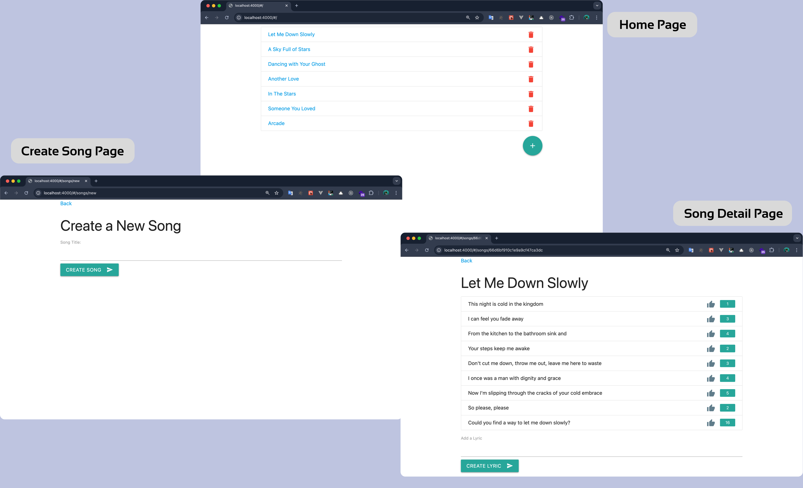

# Lyrical-GraphQL-MERN



A full-stack web application for managing songs and lyrics, built with React, GraphQL, Apollo Client, and MongoDB. Users can create songs, add lyrics to songs, and like individual lyrics.

## 🚀 Features

- **Song Management**: Create, view, and delete songs
- **Lyric System**: Add lyrics to songs with real-time updates
- **Interactive Likes**: Like/unlike lyrics with optimistic UI updates
- **GraphQL API**: Efficient data fetching with GraphQL queries and mutations
- **Real-time Updates**: Apollo Client cache management for instant UI updates
- **Responsive Design**: Material Design components for modern UI

## 🛠 Tech Stack

### Frontend

- **React** - UI library
- **Apollo Client** - GraphQL client with caching
- **React Router** - Client-side routing
- **Material Design** - UI components and styling

### Backend

- **Node.js** - Runtime environment
- **Express.js** - Web framework
- **GraphQL** - Query language and API
- **Express-GraphQL** - GraphQL middleware
- **MongoDB** - NoSQL database
- **Mongoose** - MongoDB object modeling

### Development Tools

- **Webpack** - Module bundler
- **Babel** - JavaScript transpiler
- **Nodemon** - Development server with hot reload

## 📁 Project Structure

```
lyrical-graphql/
├── client/                 # Frontend React application
│   ├── api/               # GraphQL queries and mutations
│   │   ├── mutations/     # GraphQL mutations
│   │   └── queries/       # GraphQL queries
│   ├── components/        # React components
│   │   ├── Layout/        # Layout components
│   │   └── pages/         # Page components
│   ├── style/             # CSS styles
│   └── index.js           # Client entry point
├── server/                # Backend Node.js application
│   ├── models/            # Mongoose data models
│   ├── schema/            # GraphQL schema definitions
│   └── server.js          # Express server setup
└── index.js               # Application entry point
```

## 🔧 Setup & Installation

### Prerequisites

- Node.js (v14 or higher)
- MongoDB (local installation or MongoDB Atlas)
- npm or yarn

### Installation Steps

1. **Clone the repository**

   ```bash
   git clone <repository-url>
   cd lyrical-graphql
   ```

2. **Install dependencies**

   ```bash
   npm install --legacy-peer-deps
   ```

3. **Configure MongoDB**

   - For local MongoDB: Ensure MongoDB is running on `mongodb://localhost:27017/lyricaldb`
   - For MongoDB Atlas: Update the `MONGO_URI` in `server/server.js` with your connection string

4. **Start the development server**

   ```bash
   npm run dev
   ```

5. **Access the application**
   - Frontend: `http://localhost:4000`
   - GraphQL Playground: `http://localhost:4000/graphql`

## 🎯 Usage

### Creating Songs

1. Navigate to the home page
2. Click the "+" floating action button
3. Enter a song title and submit

### Managing Lyrics

1. Click on any song from the list
2. Add lyrics using the input field at the bottom
3. Like/unlike lyrics by clicking the thumbs up icon
4. View real-time like counts

### GraphQL API

Access the GraphQL playground at `/graphql` to explore:

**Queries:**

- `songs` - Fetch all songs
- `song(id: ID!)` - Fetch a specific song with lyrics

**Mutations:**

- `addSong(title: String!)` - Create a new song
- `deleteSong(id: ID!)` - Delete a song
- `addLyricToSong(songId: ID!, content: String!)` - Add lyric to song
- `likeLyric(id: ID!)` - Like a lyric

## 🏗 Architecture

### Data Models

- **Song**: Contains title and references to lyrics
- **Lyric**: Contains content, like count, and reference to parent song

### GraphQL Schema

- Type definitions for Song and Lyric entities
- Resolvers for queries and mutations
- Relationship handling between songs and lyrics

### Apollo Client Features

- Automatic caching and cache updates
- Optimistic UI updates for likes
- Query refetching after mutations

## 🚀 Development

### Available Scripts

- `npm run dev` - Start development server with hot reload
- `npm start` - Start production server

### Development Workflow

1. Backend changes: Server auto-restarts with nodemon
2. Frontend changes: Webpack hot reload updates the browser
3. GraphQL schema: Available in GraphQL playground for testing

## 🤝 Contributing

1. Fork the repository
2. Create a feature branch (`git checkout -b feature/amazing-feature`)
3. Commit your changes (`git commit -m 'Add amazing feature'`)
4. Push to the branch (`git push origin feature/amazing-feature`)
5. Open a Pull Request
